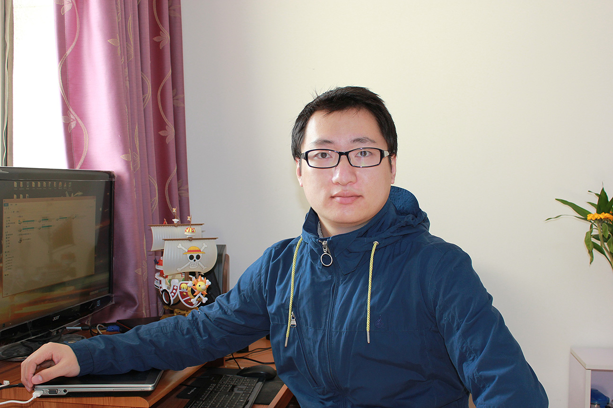



##《来自作者的信》

你好，旅行者～欢迎访问我的个人主页！

我叫曹鲁，来自中国江苏，现居住于中国上海。2010年6月我毕业于武汉大学计算机学院本科。

###我的工作经历
2010.7~2013.4 北京 供职于合众人寿总公司信息管理中心，负责Mis系统、精算准备金系统以及高管经营分析系统的开发和运维。

2013.5~`Current_Date` 上海 供职于CCOE|DDI，ebay inc. 

我的工作包括但不限于以下领域：

`Data Warehouse`，`Business Intelligence`，`Hadoop`，`Oracle`，`MySQL`，`Teradata`，`Data Analysis`，`Data Mining`，`Capacity Management`等。

我将在这里记录和分享我的工作、生活中的一些点点滴滴。

###我的业余活动
毛主席教导我们说：身体是革命的本钱～曾经很喜欢打篮球，但现在很少有机会和朋友们一起打球了，就像WOW一样。有句广告词怎么说来着？无兄弟，不篮球。

在北京的时候很喜欢爬山，但现在上海也没山能爬，这实在是一件很囧的事。

现在，我的主要业余活动是羽毛球，偶尔也会打打台球，如果刚好你也有兴趣的话，欢迎来PK一下！^_^

###我的联系方式
你可以通过以下方式与我取得联系：

Email: <whucaolu@gmail.com>

Weibo: [靈狐不要冲](http://weibo.com/whucaolu)

Skype: lionel061201

愿大地母亲忽悠着你！

--------------------------

  

<!--POPUP START-->

 

--------------------------
##关于本站
本站是曹鲁（[北落师门](http://www.lucao.com.cn)）的个人博客。

它的建立得到了来自[Jekyll Bootstrap](http://jekyllbootstrap.com) 以及Jekyll主题[The Hooligan Theme](http://github.com/dhulihan/hooligan)的帮助，同时也要感谢[Github](https://github.com)提供的主机服务。

